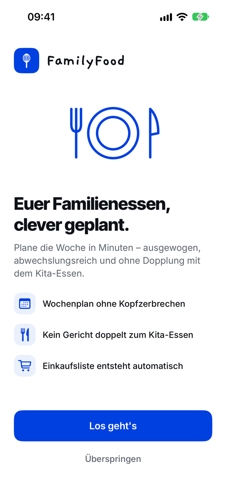
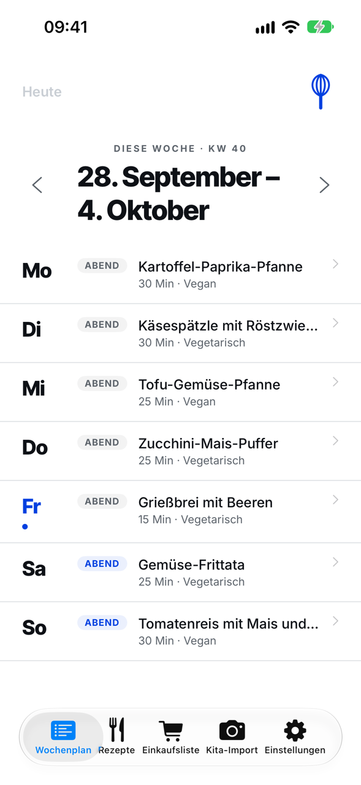
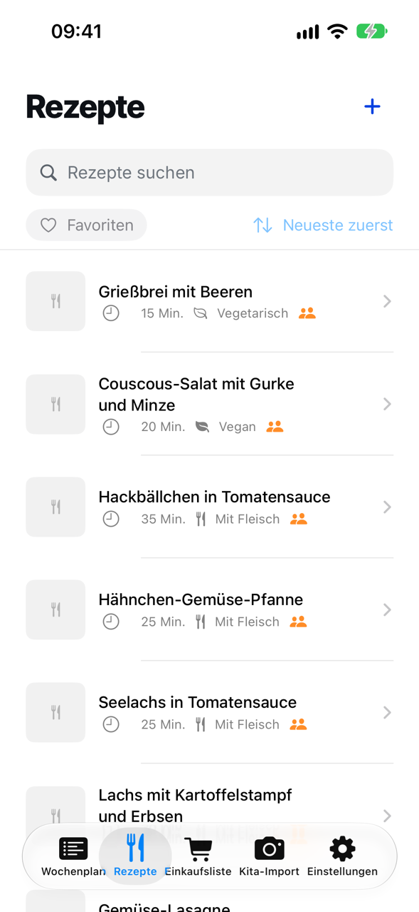
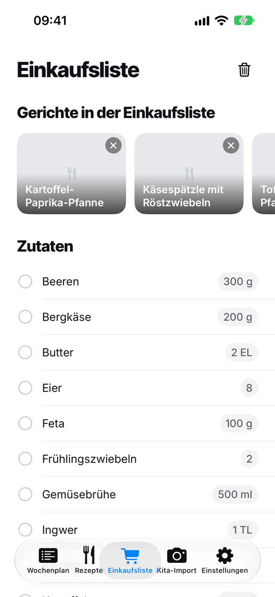

# FamilyFood

FamilyFood is a native iOS app that helps families plan a week of dinners. It suggests meals
that fit the household's diet, allergies and time budget, avoids repeating what the children
already had at kindergarten that week, and turns the plan into a shopping list.

It is written for the person in a family who plans the meals and does the shopping.

<p>
  
  
  
  
</p>

The screenshots show the sample recipes and the placeholder artwork that ship in this repository.

## State of the project

FamilyFood is a working prototype maintained by one person in their spare time. It is not on
the App Store.

What works today:

- **Onboarding** — household size, diet style, allergens, and which days get a warm dinner.
- **Weekly plan** — generates dinners for the chosen days, with variety across main ingredients;
  swap, move, pick or remove a meal; browse past and future weeks.
- **Kindergarten plan import** — photograph or share the kindergarten's meal plan (photo or PDF);
  the plan is read and its main ingredients are kept out of that week's suggestions.
- **Recipes** — browse, search and favourite; add recipes by hand, from a web page, from a
  photo, from a PDF, or through the iOS share sheet.
- **Shopping list** — the ingredients of the planned week, merged and checkable.

What is not built:

- The interface is **German only**. There is no localisation layer yet.
- Recipes store ingredients, not preparation steps.
- No sync between devices, no accounts, no backend — by design.
- No fridge or pantry tracking, no online grocery ordering.

## Where your data goes

Everything is stored on the device. There is no server, no account and no analytics.

Three things leave the device, and only when you start them:

1. **Reading a kindergarten plan or a recipe from a photo, PDF or unstructured web page** sends
   the extracted text to the [Anthropic API](https://www.anthropic.com/api) for parsing, using
   **your own API key**. You enter the key in the app's settings; it is stored on the device.
   Household settings are not part of the request. Usage is billed to your Anthropic account.
2. **Importing a recipe from a web page** fetches that page.
3. **Saving an imported recipe with a picture** downloads that picture.

Without an API key the app still plans weeks, manages recipes, imports recipes from pages that
publish structured recipe data, and builds the shopping list.

## Requirements

- A Mac with **Xcode 26 or later** (developed on Xcode 27; continuous integration builds and tests on both; the app targets iOS 17 and later)
- [XcodeGen](https://github.com/yonaskolb/XcodeGen#installing) — the Xcode project is generated,
  not committed

## Run it

```sh
git clone https://github.com/JKorsanke/FamilyFood.git
cd FamilyFood
xcodegen generate
open FamilyFood.xcodeproj
```

Choose an iPhone simulator and press Run. No signing setup is needed for the simulator.

To run on a device, copy `Config/Signing.local.example.xcconfig` to
`Config/Signing.local.xcconfig`, enter your team id and a bundle id prefix you own, and run
`xcodegen generate` again.

## Run the tests

```sh
scripts/test.sh
```

The script regenerates the project and runs the whole suite on the first available iPhone
simulator. Set `FF_DESTINATION` to pick one, and pass extra `xcodebuild` arguments through:

```sh
FF_DESTINATION='platform=iOS Simulator,name=iPhone 17' scripts/test.sh
scripts/test.sh -only-testing:FamilyFoodTests/SuggestionEngineTests
```

The tests need no network and no API key. Continuous integration runs the same script.

## How it is built

Swift and SwiftUI, MVVM, organised by feature. No third-party dependencies.

```
FamilyFood/
├── App/            entry point, root view, tab container
├── Features/       one folder per feature, each with Views/ and ViewModels/
├── Models/         recipes, weekly plans, kindergarten plans, settings
├── Services/       suggestion engine, stores, import and parsing
├── DesignSystem/   tokens and shared components
├── Utilities/
└── Resources/      fonts, asset catalog, sample recipes
ShareExtension/     receives shared pages and PDFs and hands them to the app
FamilyFoodTests/    unit tests
```

- [docs/ARCHITECTURE.md](docs/ARCHITECTURE.md) — how the pieces fit, where data lives, what
  crosses the network
- [docs/DESIGN-SYSTEM.md](docs/DESIGN-SYSTEM.md) — tokens, components and how to change them

## Contributing

Contributions are welcome — see [CONTRIBUTING.md](CONTRIBUTING.md) for setup, conventions and
the pull-request flow, and the [Code of Conduct](CODE_OF_CONDUCT.md). Please report security
problems privately, as described in [SECURITY.md](SECURITY.md).

## Licence

The code is released under the [MIT Licence](LICENSE).

The name "FamilyFood" and the maintainer's own app icon, logo and illustrations are not part of
that grant; this repository contains placeholder artwork instead. If you distribute a fork,
use your own name, icon and bundle identifier. Bundled fonts are under the SIL Open Font
License. Details are in [THIRD-PARTY-NOTICES.md](THIRD-PARTY-NOTICES.md).
